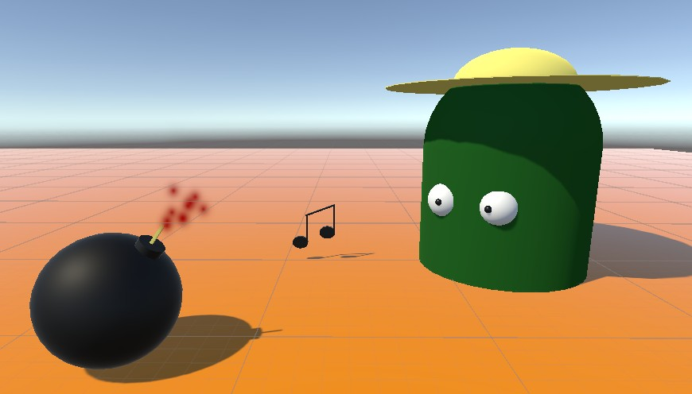

<h1>HW 1: Unity First Scene</h1>

My scene is an open field with a farmer whistling while a bomb close by is about to explode. 
I made the music note with two squashed cylinders for the notes and three cubes for the stems. 
For the farmer I made a capsule body with sphere eyes, and a flattened spheres for the hat. 
Lastly, the bomb used a sphere, a cylinder, and a cube, with particle effects to show the fuse being lit.

Navigating the menus for materials was a bit of a challenge at first, but making them was fun. 
I also learned that splitting or cutting shapes requires a bit of external software to do, so I didn't 
do it for the time being.

<a href="../index.html">Return to main page</a>

